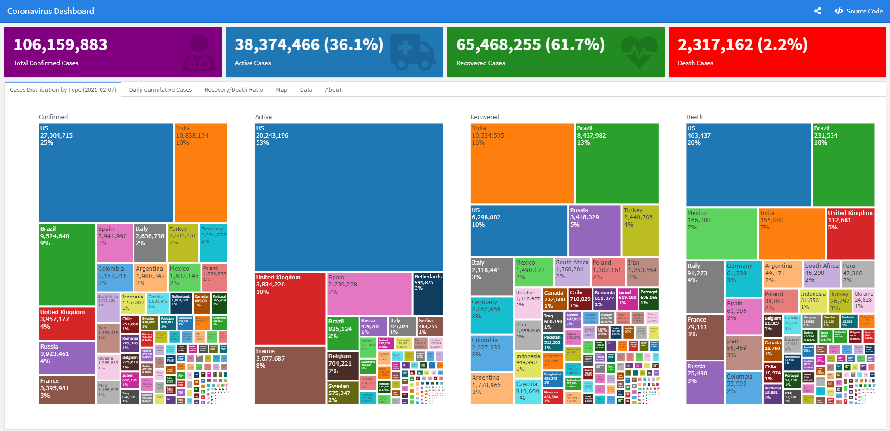
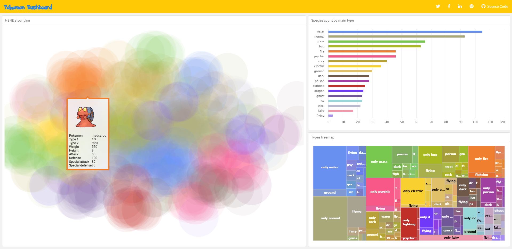
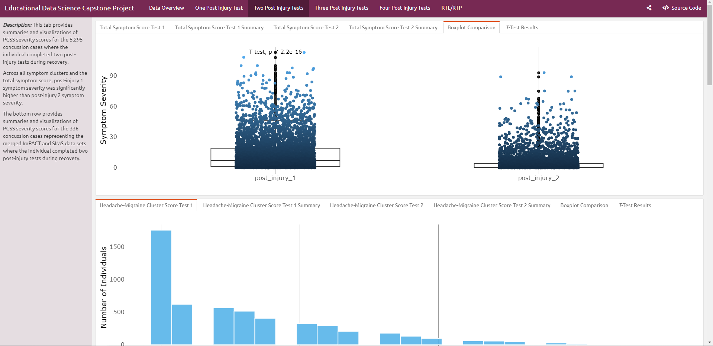
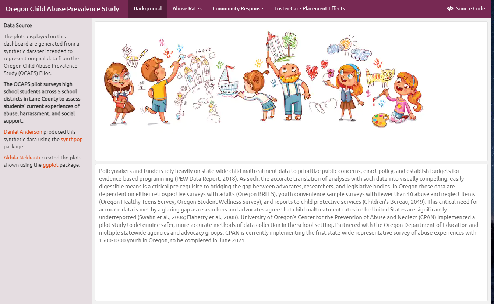
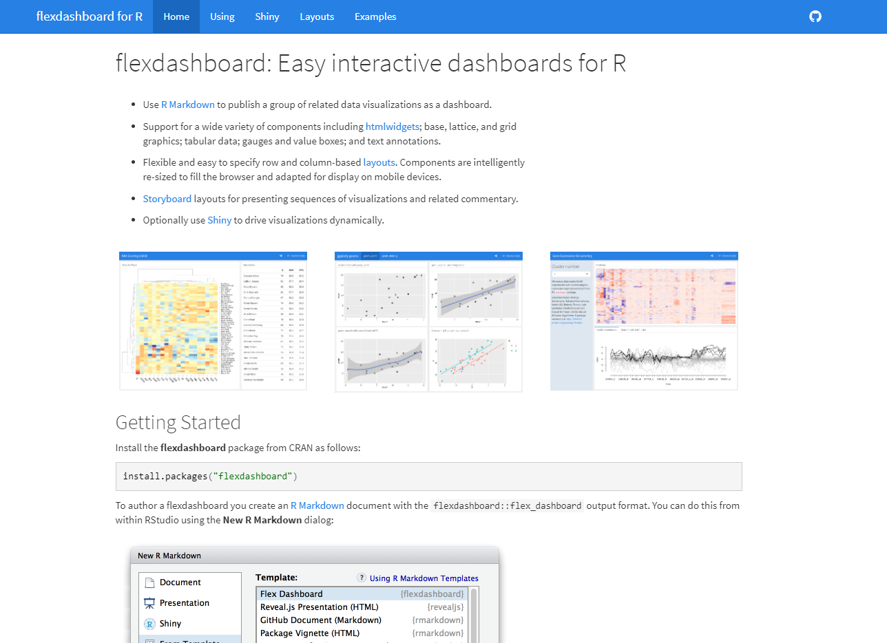
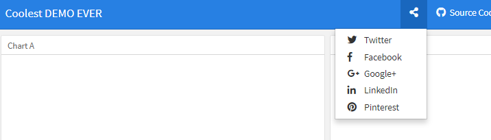
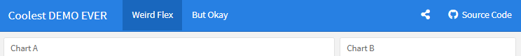
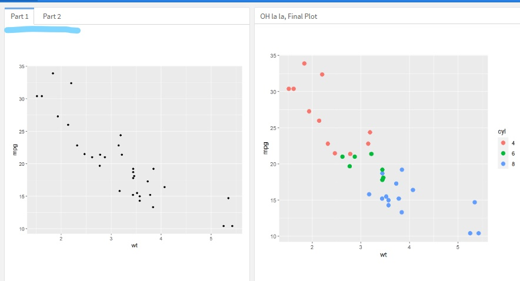

class: center, left

```{r setup, include = FALSE}

knitr::opts_chunk$set(
	echo = FALSE,
	message = FALSE,
	warning = FALSE
)
library(tidyverse)

theme_set(theme_minimal(15))
#[metropolis, metropolis-fonts]

```

```{r xaringan-themer, include=FALSE, warning=FALSE}
library(xaringanthemer)
style_mono_light(
  base_color = "#ef8b43",
  header_font_google = google_font("Josefin Sans"),
  text_font_google   = google_font("Montserrat", "300", "300i"),
  code_font_google   = google_font("Fira Mono")
)
```

#Why use a dashboard?
https://ramikrispin.github.io/coronavirus_dashboard/


---

#Why use a dashboard?
http://jkunst.com/flexdashboard-highcharter-examples/pokemon/



---
#Why use a dashboard?
https://jim-wright90.github.io/data_sci_capstone_project/



---
#Why use a dashboard?

https://github.com/akhilanekkanti1/FlexDashboards



---

# The ultimate source
https://rmarkdown.rstudio.com/flexdashboard/



---
#Where to start?

--

Workflow!

--

We want to make sure we have the *option* to make our dashboard public.

--

1. Create a new Project

--

2. Create a new Rmarkdown from template {flexdashboards}

--

3. Knit right away

--

4. Create a github Repo

--

5. Link your local and remote repos with GitKraken


---

#Mise en place: Set yourself up.

--
Open:

- R

- GitKraken

- Github


---
class: center, middle

##1. Create a new Project

File > New Project > New Directory


---
class: center, middle

##2. Create a new Rmarkdown from template and (#3) Knit

```{r install, echo = TRUE, eval = FALSE}
#One time only
install.packages("flexdashboard")
```


---
class: center, middle

##4. Create a GitHub repo and (#5) Link it with your local


---
class: center, middle

# Ready to PUBLISH!


---
class: center, middle

## Now let's play around with our dashboard! 


---
## Let's start with the YAML.

```{r eval=FALSE, echo= TRUE}

---
title: "Coolest DEMO EVER"
output: 
  flexdashboard::flex_dashboard:
    orientation: columns
    vertical_layout: fill
    social: menu #<<
    source_code: https://github.com/akhilanekkanti1/dashboard_demo #<<
---

```



---
## Let's add a new page.

```{r eval=FALSE, echo= TRUE}

Weird Flex #<<
========================= #<<

Column {data-width=650}
-----------------------------------------------------------------------

### Chart A
< r code chunk >

Column {data-width=350}
-----------------------------------------------------------------------

### Chart B
< r code chunk >
  
But Okay #<<
======================== #<<
### Chart C
< r code chunk >
  
```


---
##Play around!

- Change the name of each square

- Try adding a different plot in each square

- Can you change the number of squares in each page?

- Can you change the size of each square?

Plot example:
```{r plots, eval = FALSE, echo= TRUE}

library(tidyverse)

mtcars %>% 
  ggplot(aes(wt, mpg, col=as_factor(cyl))) +
  geom_point() +
  facet_grid(~cyl)

```

## 5 minutes :)

---
##Columns

- Create a new column with

```{}
Column
--------------------------------------
```

- Change the width of each column
  - Notice there are NO spaces around the '='
  
```{}
Column {data-width=400}
--------------------------------------
```

- Add a new square within each column

```{}
Column {data-width=400}
--------------------------------------
### New Square
```

---
##Columns vs. Rows

- If you want all rows:
```{r eval=FALSE, echo= TRUE}

---
title: "Coolest DEMO EVER"
output: 
  flexdashboard::flex_dashboard:
    orientation: rows #<<
    vertical_layout: fill
    social: menu 
    source_code: https://github.com/akhilanekkanti1/dashboard_demo 
---

```

---
##Columns vs. Rows

- If you want rows for some pages and columns for other pages:
  - don't specify the orientation
  - **do** specify which pages should be rows
  
In this example, Page 1 will have rows and Page 2 will have columns.
```{r eval=FALSE, echo= TRUE}
#change your yaml
---
title: "Coolest DEMO EVER"
output: 
  flexdashboard::flex_dashboard:
    orientation: rows 
    vertical_layout: fill #<<
    horizontal_layout: fill #<<
    social: menu 
    source_code: https://github.com/akhilanekkanti1/dashboard_demo 
---


Page 1 {data-orientation=rows} #<<
=============================== #<<

      
Page 2 #<<
=============================== #<<
```

---
##Rows

- Create a new row with

```{}
Row
--------------------------------------
```

- Change the width of each row
  - Notice there are NO spaces around the '='
  
```{}
Row {data-height=400}
--------------------------------------
```

- Add a new square within each row

```{}
Row {data-height=400}
--------------------------------------
### New Square
```

---
# You can also add a sidebar!

Here's an example from my dashboard.


---
# You can also add a sidebar!

- If you want the sidebar on all pages:

```{}
Sidebar Title {.sidebar}
===================================

This Dashboard is Important. 

RMarkdown syntax works here! 

[Click here](https://youtu.be/dQw4w9WgXcQ). 

```


- If you want the sidebar on just one page:

```{}

Sidebar Title {.sidebar}
------------------------------
```

---
#What if you want to organize your columns even more?

You can use tabs:


---
## Use tabset to split your columns or rows into tabs.

```{r eval=FALSE, echo = TRUE}
Column {.tabset} #<<
-------------------------------------

### Part 1 #<<

<r code chunk>

### Part 2 #<<

<r code chunk>


Column {data-width=650}
-----------------------------------------------------------------------

### OH la la, Final Plot
```

- For multiple arguments, there's no comma in between.

```{}
Column {.tabset data-width=350}
-------------------------------------
```

---
#to do

- interactive plots
- icons
- including text
- storyboards
- theme cusotmization and css
- adding logo and favicon


---
class: center, middle

# Thanks!

Slides created via the R package [**xaringan**](https://github.com/yihui/xaringan).

The chakra comes from [remark.js](https://remarkjs.com), [**knitr**](http://yihui.org/knitr), and [R Markdown](https://rmarkdown.rstudio.com).
