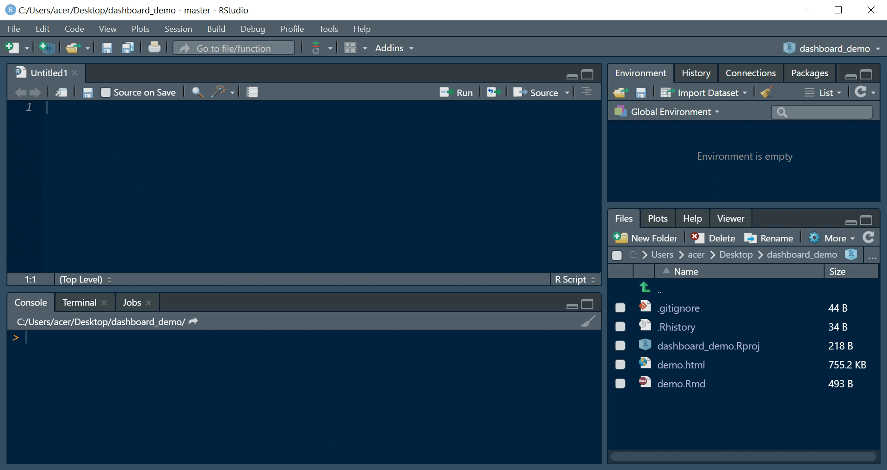

class: center, left

```{r setup, include = FALSE}

knitr::opts_chunk$set(
	echo = FALSE,
	message = FALSE,
	warning = FALSE
)
library(tidyverse)
library(here)
library(rio)
library(dplyr)
library(likert)
library(colorblindr)
library(ggridges)
library(scales)
library(fmsb)
theme_set(theme_minimal(15))
#[metropolis, metropolis-fonts]

```

```{r xaringan-themer, include=FALSE, warning=FALSE}
library(xaringanthemer)
style_mono_light(
  base_color = "#ef8b43",
  header_font_google = google_font("Josefin Sans"),
  text_font_google   = google_font("Montserrat", "300", "300i"),
  code_font_google   = google_font("Fira Mono")
)
```

#Why use a dashboard?
https://ramikrispin.github.io/coronavirus_dashboard/


---

#Why use a dashboard?
http://jkunst.com/flexdashboard-highcharter-examples/pokemon/


---
#Why use a dashboard?
http://jkunst.com/flexdashboard-highcharter-examples/pokemon/


---
#Why use a dashboard?
https://jim-wright90.github.io/data_sci_capstone_project/

*include image after getting Jim's approval

---
#Maria's example

---

# Where to start?
https://rmarkdown.rstudio.com/flexdashboard/


---
#Where to start?

--

Workflow!

--

We want to make sure we have the *option* to make our dashboard public.

--

1. Create a new Project

--

2. Create a new Rmarkdown from template {flexdashboards}

--

3. Knit right away

--

4. Create a github Repo

--

5. Link your local and remote repos with GitKraken


---

#Mise en place: Set yourself up.

--
Open:

- R

- GitKraken

- Github


---
class: center, middle

#1. Create a new Project

File > New Project > New Directory


---
class: center, middle

#2. Create a new Rmarkdown from template



---
class: center, middle

#3. Link your local and remote repos using GitKraken


---
class: center, middle

Plot 2.1
```{r plot2.1, include=FALSE, tidy=FALSE}


```


```{r likertdata, echo=FALSE, tidy = TRUE}


```
---
class: center, middle
Plot 2.2
```{r likert1, echo=FALSE}


```


---
class: center, middle

Plot 2.2

```{r likert2}


```
---
class: middle, center

Plot2.3
```{r likert3}


```


---
class: center, middle

Plot3.1
```{r echo=FALSE}


# ods %>%
#   filter(Q28 == "Strongly Agree" |
#            Q28 == "Strongly Disagree" |
#            Q28 == "Disagree" |
#            Q28 == "Agree") %>% 
#   mutate(adults = fct_recode(Q28,
#                              "Yes" = 'Strongly Agree',
#                              "Yes" = 'Agree',
#                              "No" = 'Strongly Disagree',
#                              "No" = 'Disagree')) %>% 
# ggplot(aes(district, as.factor(adults))) +
#     geom_tile(aes(fill = PATOTR)) +
#   scale_fill_viridis_c() +
#   labs(
#     fill = "Physical Abuse Score",
#     x = NULL,
#     y = NULL,
#     title = "Abuse Scores Vary by Perceived Safe Adults and District"
#   ) +
#   theme(
#     legend.position = "bottom"
#   )


```

```{r include=FALSE}


```


```{r plot3.1}


```
---
class: center, middle

Plot 3.2
```{r plot3.2}


```
---
class:center, middle
Plot 3.3
```{r}


```


  


  
```

---
class: center, middle

# Thanks!

Slides created via the R package [**xaringan**](https://github.com/yihui/xaringan).

The chakra comes from [remark.js](https://remarkjs.com), [**knitr**](http://yihui.org/knitr), and [R Markdown](https://rmarkdown.rstudio.com).
