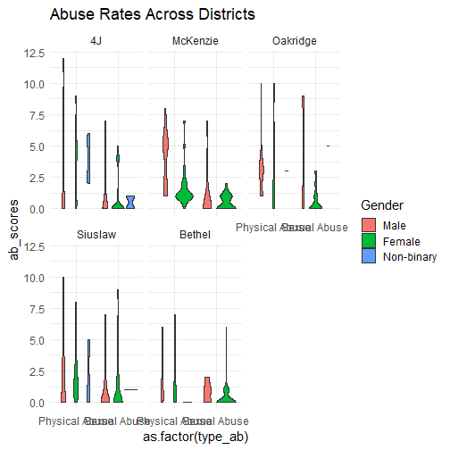
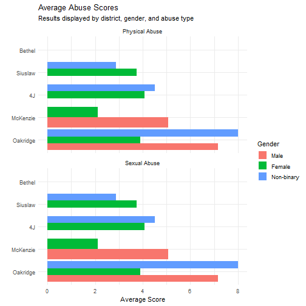
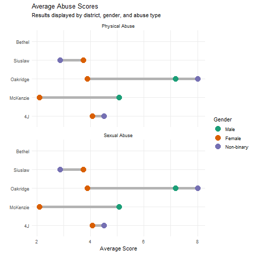
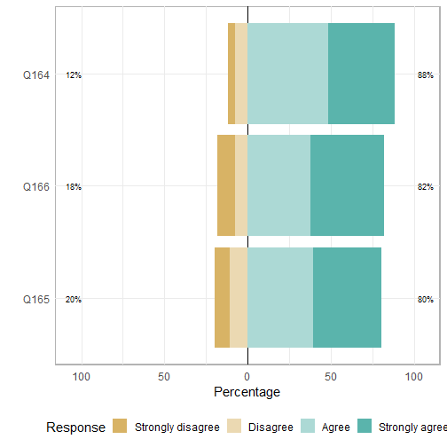
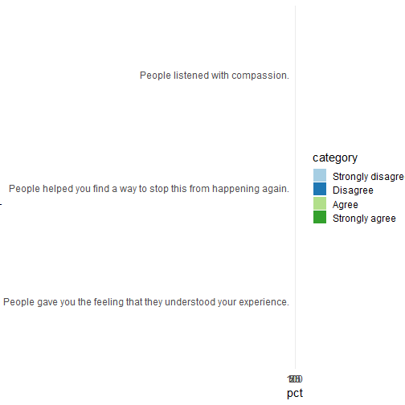
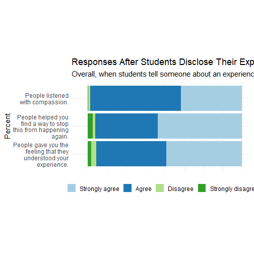
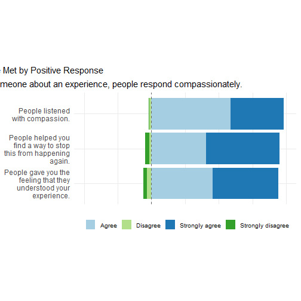
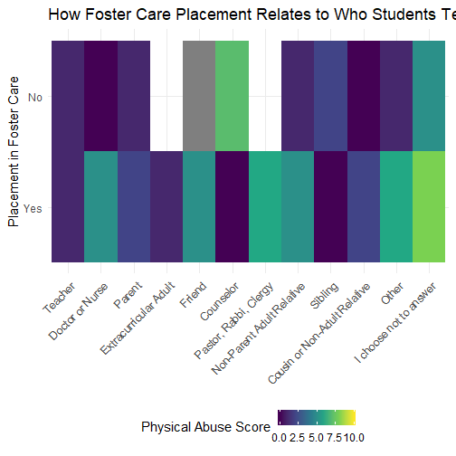
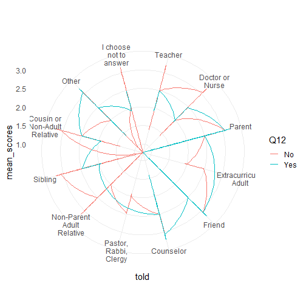
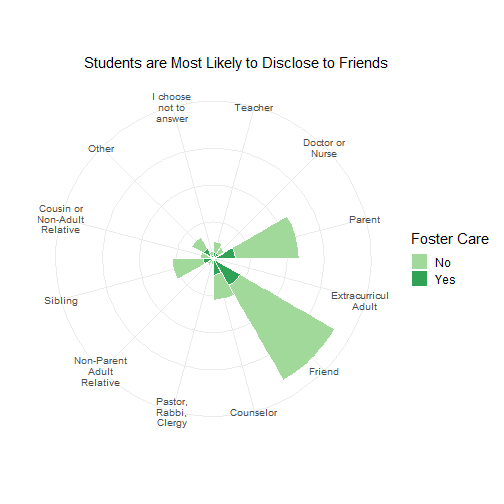

class: center, left


## Policymakers rely on publically available, easily digestible data to allocate funds and resources. It is critical then, that such data is accurate. 

--


In Oregon these data are dependent on either retrospective surveys with adults (Oregon BRFFS), youth convenience sample surveys with fewer than 10 abuse and neglect items (Oregon Healthy Teens Survey, Oregon Student Wellness Survey), and reports to child protective services (Children’s Bureau, 2019). 


---
class: left, middle

**To get a better picture of how abuse and neglect rates in Lane County look, I will present three plots.**

--
1. How abuse rates vary across school districts in Lane County.

--
2. How people in the community respond when students disclose their experience. 

--
3. How being in foster care relates to who students decide to tell, relative to abuse score. 


---
class: center, middle

Plot 1.1

<!-- -->
---
class: center, middle

Plot 1.2
<!-- -->


---
class: center, middle

Plot 1.3
<!-- -->


---
class: center, middle

Plot 2.1


<!-- -->
---
class: center, middle
Plot 2.2
<!-- -->


---
class: center, middle

Plot 2.2

<!-- -->
---
class: middle, center

Plot2.3
<!-- -->


---
class: center, middle

Plot3.1


<!-- -->
---
class: center, middle

Plot 3.2
<!-- -->

```
## List of 2
##  $ axis.title.y    : list()
##   ..- attr(*, "class")= chr [1:2] "element_blank" "element"
##  $ axis.text.y.left:List of 11
##   ..$ family       : NULL
##   ..$ face         : NULL
##   ..$ colour       : NULL
##   ..$ size         : NULL
##   ..$ hjust        : NULL
##   ..$ vjust        : num 5
##   ..$ angle        : NULL
##   ..$ lineheight   : NULL
##   ..$ margin       : NULL
##   ..$ debug        : NULL
##   ..$ inherit.blank: logi FALSE
##   ..- attr(*, "class")= chr [1:2] "element_text" "element"
##  - attr(*, "class")= chr [1:2] "theme" "gg"
##  - attr(*, "complete")= logi FALSE
##  - attr(*, "validate")= logi TRUE
```
---
class:center, middle
Plot 3.3
<!-- -->


  


  
```

---
class: center, middle

# Thanks!

Slides created via the R package [**xaringan**](https://github.com/yihui/xaringan).

The chakra comes from [remark.js](https://remarkjs.com), [**knitr**](http://yihui.org/knitr), and [R Markdown](https://rmarkdown.rstudio.com).
